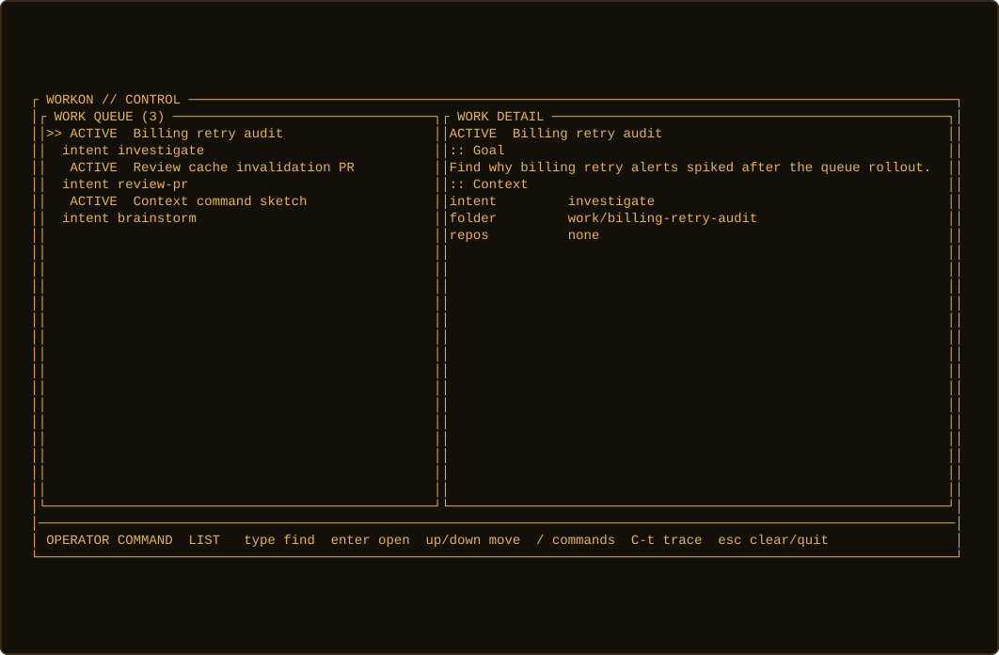
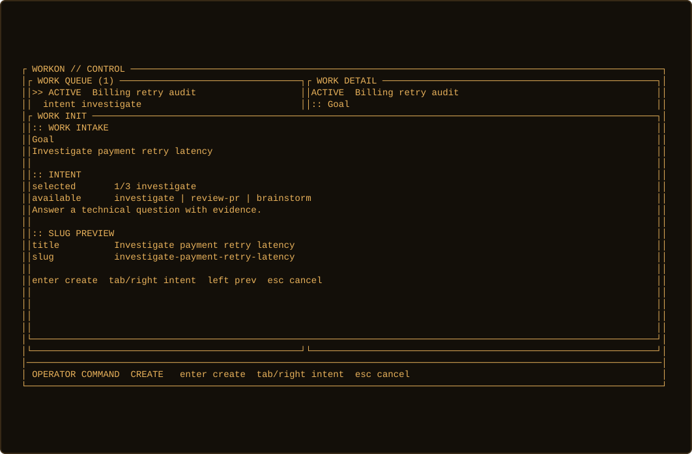
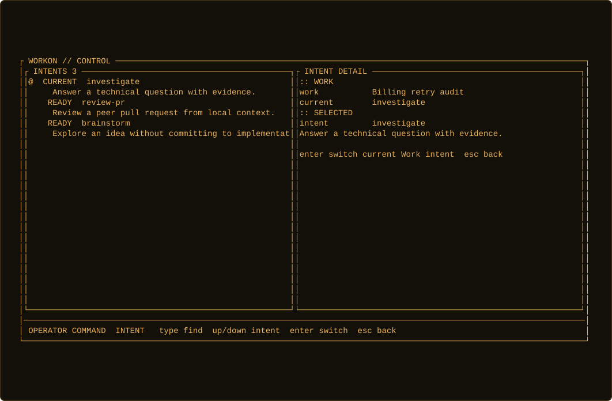
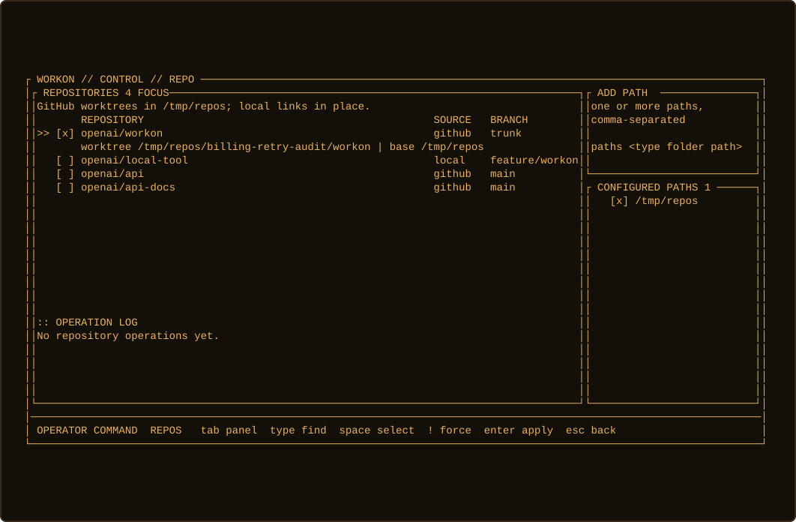

# Workon

Workon is a CLI and compact TUI for creating agent-ready context workspaces.

AI agents are replaceable. Context is not.

Workon prepares durable Work folders with goals, intent, agent instructions, and repository context. Engineers stay in control of the flow; Claude, Codex, Cursor, or future agents consume the context from the workspace.

By default, Workon stores Work in `~/.workon`. Set `WORKON_ROOT=/path/to/root` to use another root.

## Main Ways To Use Workon

Open the compact TUI:

```sh
wo
```

Use the TUI to switch Work, create Work, choose intent, and attach repositories.

Work queue:



Create Work with intent selection:



Switch intent for existing Work:



Attach repository context:



Print active Work directly in the terminal:

```sh
wo list
```

## Install

Homebrew:

```sh
brew install philipesteiff/tap/workon && wo install-shell
```

Restart the shell, or source the script printed by the command.

Local development:

```sh
just install-dev-shell
just verify
```

## What Workon Creates

Each Work gets a folder:

```text
~/.workon/work/<title>/
```

The folder holds agent files, notes, outputs, repositories, evidence, and artifacts.

`AGENTS.md` is the portable source. Agent-specific files like `CLAUDE.md` are projections.

Intent profiles add weight to generated agent instructions. They tell the agent which skills, MCPs, sources, and output style to prefer. Weight means preference, not enforcement.

## Principles

- Context-first
- Agent-agnostic
- Tool-agnostic
- Repo-native
- Dynamic by default
- Pluggable by default

## Non-Goals

- Not an AI IDE
- Not another chat app
- Not the agent
- Not a terminal app
